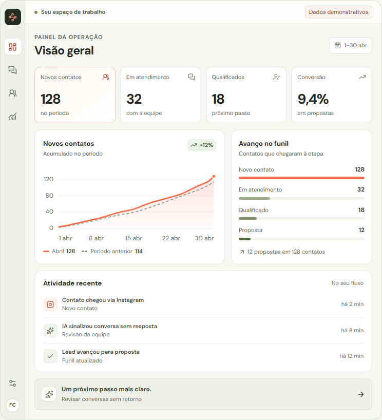

# Refinamento do painel e da landing page

Registro técnico do refinamento da página inicial do **Fluxo de Clientes**, em 2 de outubro de 2026.

## Problema e decisão

A prévia anterior concentrava o painel, o gráfico e o funil dentro de `app/pages/index.vue`. Os textos pequenos, a redução da interface no celular e as contagens desconectadas dos cartões dificultavam entender o produto. O gráfico também dependia de caminhos SVG escritos manualmente, sem uma série de dados compartilhada com os indicadores.

A mudança dá prioridade à leitura e à coerência dos exemplos: componentes próprios, hierarquia visual mais clara, dados derivados de uma fonte comum e redistribuição do conteúdo conforme o espaço disponível. O movimento explica a passagem do contato até a oportunidade e respeita a preferência por movimento reduzido.

## Escopo entregue

- Painel com quatro indicadores, gráfico de contatos acumulados, avanço no funil, atividades recentes e uma ação que abre a demonstração de atendimento.
- Gráfico construído a partir de valores explícitos, com período anterior, legenda, descrição acessível e rótulos de eixo em HTML para preservar o tamanho da fonte.
- Funil com três etapas e seis contatos fictícios. Cada cartão mostra origem, próximo passo e responsável; as contagens correspondem aos cartões exibidos.
- Fluxo animado de **Contato → Conversa → Oportunidade**, com reprodução manual e conclusão comunicada por uma região de status acessível.
- Ajustes de espaçamento, apresentação no celular, foco visível e ciclo de vida das animações na página inicial.
- Remoção dos controles decorativos do antigo funil. A identificação do período no painel é informação estática; a barra lateral é uma ilustração oculta para leitores de tela.

## Organização dos arquivos

| Arquivo | Responsabilidade |
| --- | --- |
| `app/pages/index.vue` | Compor a página, definir tokens visuais, abrir a demonstração e controlar as animações de entrada e de rolagem. |
| `app/components/landing/DashboardPreview.vue` | Mostrar indicadores, avanço no funil, atividades e emitir `open-demo` quando a ação do painel é acionada. |
| `app/components/landing/ContactTrend.vue` | Transformar a série em coordenadas, renderizar o gráfico acessível e animar o traçado atual. |
| `app/components/landing/PipelinePreview.vue` | Apresentar os contatos fictícios e calcular o total e as contagens de cada etapa. |
| `app/components/landing/CustomerFlow.vue` | Explicar visualmente as três etapas e administrar reprodução, entrada em tela e movimento reduzido. |
| `app/utils/contactTrend.ts` | Manter os dados demonstrativos, os totais compartilhados, as etapas do painel e a interpolação das curvas. |
| `tests/contact-trend.test.mjs` | Verificar coerência dos dados, casos limites e geometria das curvas com o executor de testes do Node.js. |
| `.github/workflows/ci.yml` | Executar o build padrão e, em seguida, `npm test` no GitHub Actions com Node.js 22. |

Os componentes mantêm seus estilos locais com `scoped`. A ação real do painel segue o fluxo existente: `open-demo` chega à página, que usa `createChat()` e navega para `/chat/:id`.

## Dados e fórmulas

A série `contactTrend` possui 12 pontos entre os dias 1 e 30 de abril. Os valores representam contatos **acumulados**, e a série cresce de 3 até 128 contatos. O período anterior termina em 114. Os dois totais são extraídos do último ponto, mantendo gráfico e indicadores sincronizados.

| Informação | Valor demonstrativo | Origem |
| --- | --- | --- |
| Novos contatos no período | 128 | Último valor `current` de `contactTrend`. |
| Contatos do período anterior | 114 | Último valor `previous` de `contactTrend`. |
| Em atendimento | 32 | Etapa correspondente de `demoPipeline`. |
| Qualificados | 18 | Etapa correspondente de `demoPipeline`. |
| Propostas | 12 | Etapa correspondente de `demoPipeline`. |
| Conversão em propostas | 9,4% | `12 / 128 × 100`, com uma casa decimal e vírgula na exibição. |
| Crescimento sobre o período anterior | +12% | `(128 / 114 − 1) × 100`, arredondado para inteiro. |

O quadro “Avanço no funil” representa contatos que chegaram a cada etapa. Seus valores não devem ser somados como categorias independentes. A largura de cada barra usa o total de contatos como denominador.

`createTrendPath()` calcula uma curva cúbica monotônica a partir dos pontos. Isso mantém o desenho associado aos valores e limita os controles de interpolação para evitar oscilações artificiais entre eles. A série anterior usa tracejado, oferecendo uma distinção além da cor. O SVG inclui título e descrição com identificadores gerados por `useId()`.

O componente `PipelinePreview` é outro exemplo ilustrativo: mostra **2 contatos por etapa e 6 no total**. Ele não representa a lista completa dos 128 contatos do painel. Todas as contagens desse componente são calculadas a partir de seus próprios cartões.

## Linguagem visual e tokens

A página define os tokens abaixo, consumidos pelos componentes conforme a necessidade. Os componentes mantêm valores de fallback para apresentação isolada.

| Token | Valor | Uso |
| --- | --- | --- |
| `--preview-ink` | `#24271f` | Texto principal. |
| `--preview-muted` | `#62685e` | Texto de apoio e eixos. |
| `--preview-border` | `#e2e6dc` | Bordas dos painéis e cartões. |
| `--preview-surface` | `#fff` | Superfícies principais. |
| `--preview-subtle` | `#f6f7f3` | Superfícies de apoio. |
| `--preview-coral` | `#f46b4d` | Série atual e destaques. |
| `--preview-sage` | `#eef1e9` | Superfícies em verde suave. |
| `--preview-radius` | `16px` | Arredondamento externo compartilhado. |
| `--preview-shadow` | `0 20px 60px rgb(36 39 31 / 8%), 0 2px 8px rgb(36 39 31 / 4%)` | Profundidade discreta dos painéis. |

Os ícones de interface usam `UIcon` com a coleção Lucide. Os três símbolos do fluxo animado são caminhos SVG locais, necessários para a transformação entre formas. O fundo branco, as bordas leves e os destaques coral e verde mantêm a mesma linguagem entre os exemplos.

## Layout responsivo e acessibilidade

- A página passa a uma coluna para hero, funil e área de IA em larguras de até 1150px.
- O painel responde à largura de seu contêiner. Até 650px, os indicadores passam de quatro para duas colunas e gráfico e funil se empilham. Até 560px, a barra lateral desaparece, os textos de apoio ganham 12px e as atividades reorganizam os horários. Até 360px, as etapas do resumo do funil ocupam uma coluna.
- O quadro de contatos mostra três etapas lado a lado quando há espaço. Em contêineres de até 560px, as etapas se empilham; abaixo de 380px internos, os cartões também ficam em uma coluna. No celular, as colunas são empilhadas por regra de viewport adicional.
- O funil usa fontes de pelo menos 12px. Os eixos do gráfico são elementos HTML com 12px, evitando o encolhimento do texto junto com o `viewBox`.
- Botões reais preservam foco visível. O botão de reprodução é acessível por teclado e fica desabilitado durante a animação ou quando o movimento reduzido está ativo.
- A informação essencial permanece em texto: nomes das etapas, próximos passos, legenda e descrição do gráfico. Cor e movimento complementam esse conteúdo.

## Animações e ciclo de vida

| Área | Comportamento | Duração |
| --- | --- | --- |
| Texto do hero | Entrada com opacidade e deslocamento vertical de 16px. | 0,55s por elemento, intervalo de 0,08s. |
| Prévia do hero | Entrada com opacidade e deslocamento vertical de 20px. | 0,7s, sobreposta à entrada do texto. |
| Seções da página | Deslocamento vertical de 18px ao chegar a 92% da altura da tela; executa uma vez. | 0,6s por seção. |
| Gráfico | `DrawSVGPlugin` revela o traçado da série atual. | 1,4s, após espera de 0,35s. |
| Fluxo do cliente | `DrawSVGPlugin` desenha conexões, `MotionPathPlugin` conduz o sinal e `MorphSVGPlugin` transforma os símbolos das próximas etapas. | 2,85s no total; deslocamentos de 0,8s e transformações de 0,4s. |

O fluxo começa quando 40% do componente entra na área visível. O `IntersectionObserver` é desconectado ao iniciar a reprodução; novas execuções são solicitadas pelo botão “Reproduzir fluxo”. Não há repetição infinita.

As animações são criadas após a montagem e registradas em contextos de `gsap.matchMedia()`. A página e o gráfico chamam `revert()` ao desmontar. O fluxo também desconecta o observer e reverte seus contextos. O escopo é local aos componentes; a navegação não depende de destruir globalmente todos os `ScrollTrigger` da aplicação.

Com `prefers-reduced-motion: reduce`, as entradas e o traçado animado não são executados. O fluxo apresenta as três etapas completas, informa o modo estático e desabilita a reprodução. A troca dessa preferência durante a animação reverte os estilos e restaura a apresentação estática. A mesma condição é respeitada quando a preferência muda novamente.

## Limites do protótipo

O painel, as atividades, o gráfico e os contatos são exemplos ilustrativos identificados na interface. Não há conexão com canais reais, consulta a dados operacionais, processamento de IA ou atualização em tempo real.

O atendimento continua usando o estado transitório de `useVisualChats()`. A mudança não adiciona backend, banco de dados, armazenamento persistente nem novas chamadas de API. Recarregar a aplicação pode perder as conversas locais.

Não foi inserido FLIP: o escopo não contém reordenação, filtragem interativa ou movimentação real de cartões que justifique animar uma mudança de layout. Se essas interações forem implementadas, a técnica poderá ser avaliada para representar a transição de estado.

## Validação registrada

Resultados observados até este registro:

| Verificação | Resultado |
| --- | --- |
| ESLint nos arquivos alterados | Aprovado. |
| Larguras de 1440, 1280, 1152, 1024, 768, 390 e 320px | Sem overflow horizontal observado. |
| Console e hidratação nos cenários de interface verificados | Sem erros observados. |
| Ação do painel e CTA principal do hero | Criaram uma conversa e navegaram para a rota de chat. |
| Retorno à página inicial após navegar para o chat | Verificado duas vezes. |
| FAQ | Abertura e fechamento verificados na versão de produção. |
| Reprodução do fluxo por teclado | Verificada. |
| Ativação de movimento reduzido durante a animação | Verificada; fluxo restaurado para o estado estático. |
| `npm test` | Aprovado: 3 testes, sem falhas. |
| Verificação de TypeScript | Aprovada com `vue-tsc` e TypeScript 5.9.3, executados temporariamente sem adicionar dependências ao projeto. |
| Build de produção padrão, no ambiente Windows local | Cliente e SSR compilados; empacotamento Nitro interrompido por `EPERM` ao executar `readlink` em uma pasta ancestral do workspace. |
| Build local com escopo de rastreamento restrito ao projeto | Aprovado. `nitro.externals.traceOptions.base = process.cwd()` aplicado apenas durante a execução; configuração original restaurada e sem alteração no PR. |
| Versão de produção servida localmente | Matriz de sete larguras e interações repetida com sucesso; sem erros de JavaScript, hidratação ou ícones ausentes. |
| Build padrão no GitHub Actions | Executado automaticamente a cada atualização do PR; consultar os checks do commit atual. |

Os testes automatizados usam `node --experimental-strip-types --test tests/*.test.mjs`, exposto como `npm test`, e cobrem:

| Teste | Critério |
| --- | --- |
| Coerência dos dados | Totais, conversão de 9,4%, dias crescentes, séries acumuladas sem regressão e etapas do funil com contagens decrescentes. |
| Série vazia e ponto único | Saída prevista, sem geometria inválida. |
| Intervalos da curva | Pontos finais corretos e amostragem das curvas dentro dos limites de cada intervalo, incluindo platôs e mudanças de direção. |

A verificação de tipos foi executada com `npm exec --package vue-tsc --package typescript@5.9.3 -- vue-tsc --noEmit -p .nuxt/tsconfig.app.json`. A versão temporária do TypeScript foi fixada para compatibilidade com o carregador de `vue-tsc`; isso não altera as dependências declaradas do projeto.

O resultado do build padrão está registrado nos checks e na descrição do PR. A validação local com `traceOptions.base` restrito à pasta do projeto não faz parte da configuração entregue e não substitui essa verificação. Este registro de QA descreve os cenários exercitados, sem presumir cobertura de navegadores ou fluxos não verificados.

## Evidências visuais

Capturas da versão de produção local, com movimento reduzido para preservar o estado completo de cada interface. A reprodução com movimento habilitado foi validada separadamente, incluindo acionamento por teclado e mudança de preferência durante a sequência.

- [Página completa em desktop, 1440px](screenshots/landing-desktop.png)
- [Página completa em celular, 390px](screenshots/landing-mobile.png)
- [Quadro de contatos](screenshots/pipeline-premium.png)
- [Fluxo do cliente](screenshots/fluxo-cliente.png)
- [Registro dos sete tamanhos e interações](qa/dashboard-premium.json)

